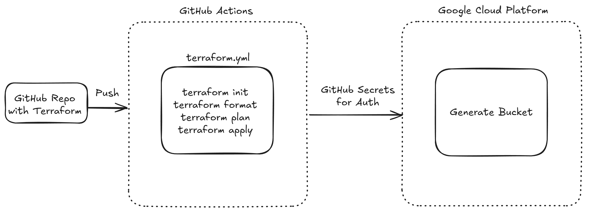
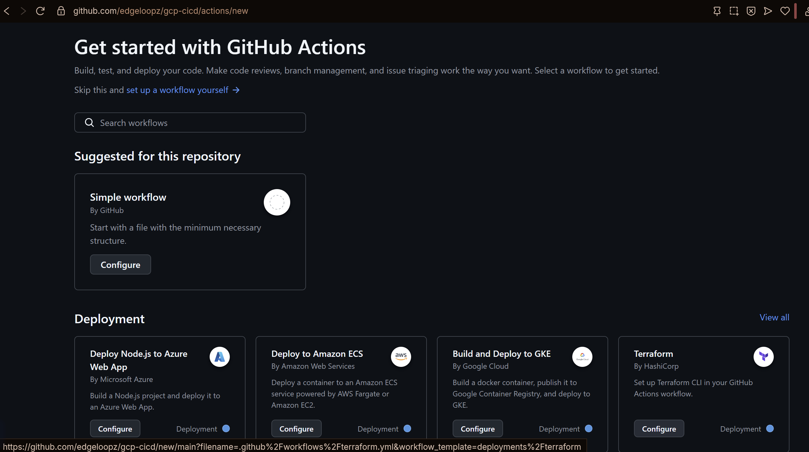
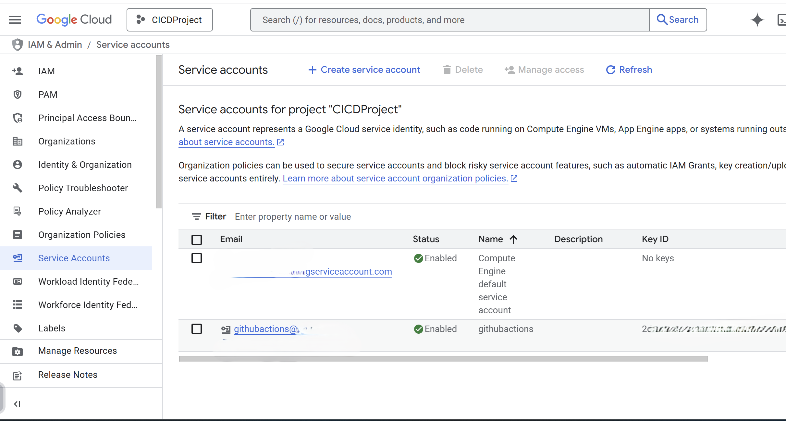
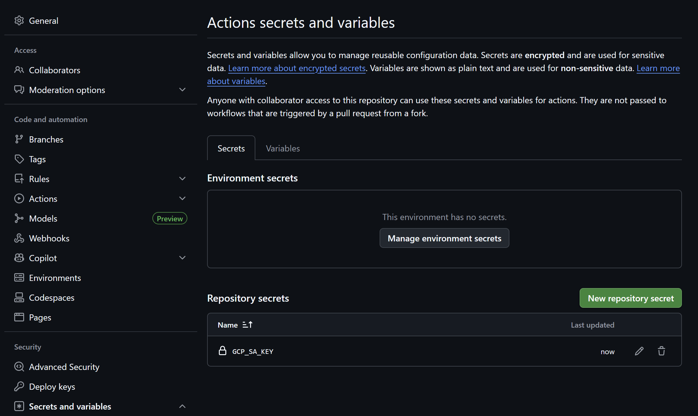
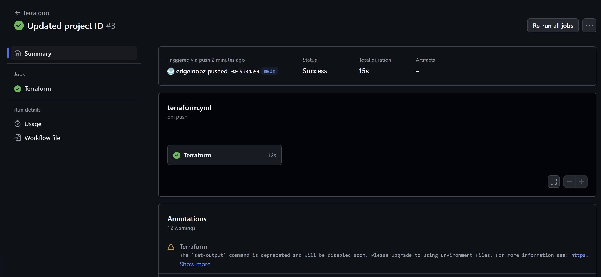
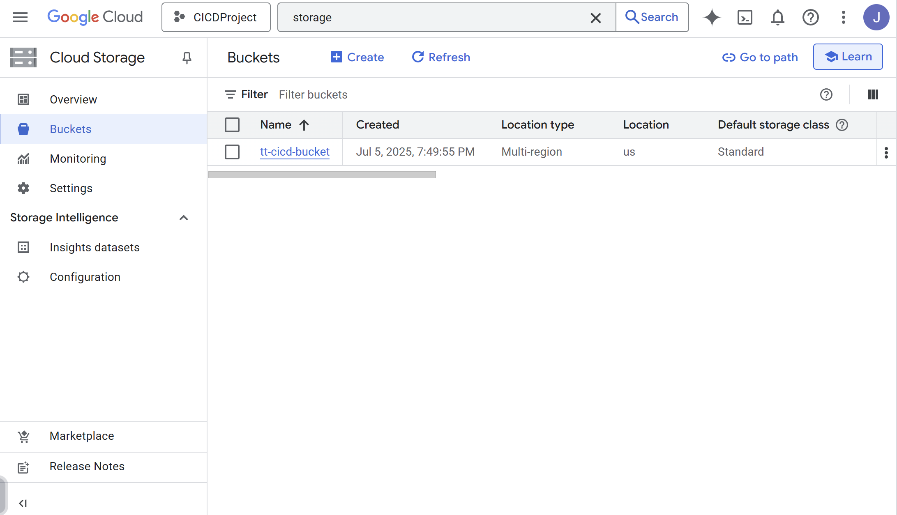

# Creating a Google Cloud CI/CD Pipeline with Terraform and GitHub Actions

## Overview
In this project, I wanted to learn about infrastructure as code using Terraform for Google Cloud Platform, as well as how to create a CI/CD environment with something like GitHub Actions. This project uses the following components:

- Terraform to generate infrastructure as code
- GitHub Actions to handle Terraform
- Google Cloud Platform to generate a storage bucket from Terraform Code

## Workflow Design



This is the workflow design that the project aims to follow. On git push, GitHub Actions will read from the generated terraform.yml file to run the Terraform commands. If everything is valid, GitHub secrets will be used to allow a service account to generate the infrastructure via the Google Cloud Platform.

## Project Summary
With this project, I started by generating the Terraform code. I had to choose my provider and set the project being used in the cloud with the following code:

```
terraform {
  required_providers {
    google = {
      source  = "hashicorp/google"
      version = "~> 6.42"
    }
  }
}

provider "google" {
  project = "cicdproject-465101"
  region  = "us-west1"
}
```
The last portion of the Terraform code was used to generate the storage bucket as proof of concept.

Once this code was generated, I began setting up the GitHub Actions Workflow. I opened my repo and went to the Actions portion which looks like this:



From here, I chose the Terraform workflow as seen in the bottom left. This generated a .github/workflows directory and contains a terraform.yml file. This is the file that handles all of the terraform commands that GitHub Actions will execute. From here, in order to let GitHub Actions create infrastructure, I had to generate a service account for GitHub Actions as seen here (key and names sanitized for security purposes):



I clicked on the account and generated a key, which gave me a JSON file containing the key. I then went to the repo, went to the general settings, clicked the "Secrets and Variables" section on the left-hand side, and then added a repository key with the contents of the JSON file named **"GCP_SA_KEY"**. Once completed, the section should look like this:



This allowed terraform to access my Google Cloud account and generate the storage bucket as requested by terraform on git push. I ran into some issues with Terraform formatting, but using the terraform fmt command corrected them. Once corrected, creating infrastructure using the Terraform workflow in GitHub Actions was successful:



As this was successful, Terraform was able to generate the Google storage bucket outline within the code:



This completes what I was setting out to do within this project.
## Future Features

In the future, I plan to implement multiple new features such as:
- Integrate new files in the repo and validate them through Actions
- Using the pipeline to generate a web service
- Learn about Terraform Variables and apply them to the workflow

## Final Thoughts

This project taught me a lot about using GitHub Actions and generating/using secrets. Being able to manage Terraform code through GitHub Actions to generate cloud infrastructure was interesting and will help me in future cloud projects.